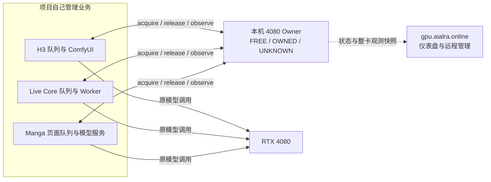

# 4080 Owner v1：独立于旧 Broker 的设计稿

**状态：设计已获准实施；代码、三项目接入与生产切换分别验收，本文不表示已部署**

首版产品选择是：H3 长视频持有 4080 时，Live 的 GPU 模型任务等待；录音保存和 ACK 继续。H3、Live 的其他 Codex 迭代优先；运行中的服务与 GPU 测试要避开它们的高优先级工作。设计获准后按 Core、H3、Live、Manga、真实交接的顺序实施，不提前启用共享生产门禁或创建新资源画像

## 一张图

Coordinator 不接收媒体，不创建业务 job，不知道视频尝试次数、模型类型、页面编号、输出、业务重试或成功状态。公网网站及隧道不在本机模型调用路径上。现有 Broker 把监控与准入放在同一进程；图中的故障隔离是目标，尚未实现

**核心不变量：旧 Owner 运行时宁可继续；新 Owner 获取时宁可等待。** `UNKNOWN` 冻结新 acquire，但不能自动取消已经提交给模型后端的工作

四条实施禁令：① `UNKNOWN` 只能由直接且新鲜的项目／后端与整卡事实恢复，时间流逝不能释放；② `release()` 只是项目提出交接请求，必须观察确认后才变 `FREE`，过程不落第四个稳定状态；③ Coordinator 不具备杀 ComfyUI、Ollama 或 Manga 推理的能力，其故障不能主动终止已提交计算；④ `FREE` 的并发 acquire 是唯一必须原子互斥的所有权授予点，同时只能一个成功。登记 H3 却观察到 Manga 也忙时变 `UNKNOWN`，保留两边已有工作并告警，不猜真实 Owner

后台定期观察即使连续看到当前项目已封门、模型已卸载，也不会替它自动调用 `release()`；登记仍是 `OWNED`，下一个项目等待。项目提出 release 后才核查并交接。协调器重启先进入 `UNKNOWN`，此时只有三项目与整卡的新鲜直接事实都证明空闲，才能恢复 `FREE`

## 最小持久数据

一张按 GPU UUID 唯一的 Owner 记录；v1 仅对计算卡 GPU0 创建记录，2070 SUPER 仍作显示用途

| 字段 | 含义 |
| --- | --- |
| `gpu_uuid` | 本机计算卡 UUID，Owner 行的主键 |
| `state` | 严格为 `FREE`、`OWNED`、`UNKNOWN` |
| `owner_project` | `h3`、`live`、`manga` 或空；`UNKNOWN` 时保留最后可疑项目以便核查 |
| `owner_instance` | 每次获取生成且项目持久保存的不透明随机 ID；Coordinator 不解析其中的业务信息，旧持有者迟到的 release 必须因 ID 不符而被拒绝 |
| `acquired_at` | 本次 Owner 开始时间；`UNKNOWN` 时保留最后已知值 |
| `last_observed_at` | 最近一次可信观察时刻，仅用于判断证据新旧，**不是超时后杀任务或自动释放的租约** |

v1 **不持久化 waiter，不保证公平排队、优先级或等待顺序**：未获权的业务任务留在各项目原队列，以有限退避重试 acquire；项目只向仪表盘报告“正在等待 4080”，不把业务任务复制到 Coordinator。这样没有失效 waiter 阻塞后续项目；若真实使用证明饥饿，再单独评估最小排队规则。审计事件可保存状态转移和简短原因，不进入 Owner 主记录。认证凭据与项目权限是接口安全边界，不属于 Owner 业务状态；不能因为压缩数据模型就让任意本机或公网调用者取得所有权

**v1 范围冻结：** 只保留 FREE／OWNED／UNKNOWN 与 acquire／release／observe。不增加项目业务阶段、资源画像、每阶段许可、业务重试、结果状态、跨项目优先级或公平队列；新增功能必须先证明上述最小模型无法满足真实需求

每次新持有窗口使用新的随机 `owner_instance`，同一获取请求重试沿用原 ID。成功 release 后此 ID 永久作废，不可用于再次 acquire；Coordinator 的持久 acquire 事件对 ID 建唯一约束，拒绝迟到的旧 acquire。release 必须比较当前行中的项目与实例 ID，拒绝迟到的旧 release。这些事件仅维护操作身份和审计，不记录业务任务或阶段

本机接口使用现有项目凭据作为**项目身份**，可在迁移时安全轮换；服务仅绑定回环地址，公网不直接暴露 acquire／release／observe。Coordinator 从经验证的凭据推导 `project`，不相信请求体自行声称的项目名。每个项目凭据只能为本项目 acquire／release、报告本项目观察和读取必要的 Owner 摘要；release 仍须同时匹配当前 `owner_instance`。Coordinator 主动查询项目适配器时，需核对预先配置的回环地址与该项目服务身份，不能接受任意客户端提交的“其他项目 IDLE”观察。凭据保存在受限的本机密钥文件或 Windows DPAPI 中，不写入网站或日志。网站管理令牌不能代替项目凭据，也不能通过公网直接伪造项目观察。这是一次项目身份校验，不引入每阶段 permit、签名任务键或秒级续约

## 三态与原子转移

| 当前 | 条件 | 下一状态与处理 |
| --- | --- | --- |
| 服务启动 | 无论旧库写着什么 | `UNKNOWN`，先核查项目后端和整卡；绝不因没有旧 active permit 直接宣告 `FREE` |
| `UNKNOWN` | 与持久 `owner_instance` 一致的项目证实 Owner 窗口仍开放，可能是模型运行／驻留，也可能是同一业务执行的阶段间隙；其余两项目给出新鲜的空闲／已退出观察，整卡无矛盾 | `OWNED(该项目)`；继续原任务，不重新提交已提交的模型请求。阶段间隙显存低不能剥夺其 Owner；任一项目观察缺失则仍为 `UNKNOWN` |
| `UNKNOWN` | 三项目适配器或其监督进程均给出新鲜的无 GPU 工作／已卸载观察，原 Owner 窗口的 GPU 入口已关闭且不会再启动下一阶段，没有遗留子进程，整卡用量处于经实测的空载范围 | `FREE`；项目服务关闭时也须由监督进程确认原模型子进程确已退出。H3 两个阶段之间虽暂时没有推理，Owner 窗口未关闭时不能报 `IDLE`。任何观察缺失、矛盾或显存异常都继续 `UNKNOWN` |
| `FREE` | 任一项目请求，空闲观察仍可信；在单一数据库事务中比较并设置 | `OWNED(project, owner_instance)`；同一申请 ID 重试返回同一结果。v1 没有 FIFO，事务先到者获权 |
| `OWNED` | 同一实例重试 acquire | 仍为原 `OWNED`，不生成第二份所有权 |
| `OWNED` | 当前项目请求 release，项目适配器确认本轮后端停止、模型释放，整卡回到安全范围 | 事务性变 `FREE`；等待项目按退避策略重新 acquire。迟到或异项目 release 拒绝 |
| `OWNED` | 项目观察失联、协调器重启、释放证据缺失、其他项目也报告 GPU 工作或整卡明显矛盾 | `UNKNOWN`，保留上次 owner 信息，继续观察原后端，不杀在跑任务 |
| `UNKNOWN` | 管理员只看见低显存、空队列或旧许可已结束其中单项 | 保持 `UNKNOWN`；不能凭单项线索强制变 `FREE` |

`RELEASING` 只是 release 请求的事务内过程，首版不存第四个 Owner 状态。进程间竞争与重试必须由原子比较和 `owner_instance` 保证；“先读 FREE，再各自开始模型”不具备互斥性。若协调器本机不可达，正在执行的任务继续；新 GPU 工作等待，除非将来另有经过崩溃和遗留子进程验证的本机独占原语

v1 暂以 10 秒作为整卡遥测与项目观察的最大证据年龄；超过即不用于 acquire／release，Owner 进入或保持 `UNKNOWN`，在跑任务不取消。整卡采样由 Coordinator 自己生成时间戳；项目观察须由 Coordinator 向预配置回环地址发起带随机挑战的新请求，项目适配器现查后端并用本项目凭据对响应签名，回传挑战和采样时刻。Coordinator 不把项目凭据发给观察端口，避免端口被其他本机进程占用时泄漏；核对签名、挑战、同机时钟偏差、请求耗时，并以自己收到响应的时刻计算缓存年龄。超时、复用旧响应或无法确定采样时间均视为 `UNKNOWN`。项目观察与整卡采样必须在一次序列化的准入判定中核对时间戳与当前 Owner 行；乱序或较旧响应不得覆盖较新的观察。这个阈值是待负载试验校准的证据有效期，不是运行任务的死亡计时器。它不能单独阻止采样后某个未接入的进程加载模型；互斥依赖三个已接入项目的全部 GPU 入口遵守 Owner 契约

## 三个操作

| 操作 | 最小请求／响应 | 责任边界 |
| --- | --- | --- |
| `acquire(project, owner_instance)` | 返回 `ACQUIRED`、`WAITING` 或 `UNKNOWN` 及当前 Owner 摘要 | 项目在**任何新模型加载或 GPU 执行**前调用；获取结果可幂等重试。`WAITING` 和 `UNKNOWN` 都不允许启动新的 GPU 工作；项目队列退避重试，不在 Coordinator 存 waiter |
| `release(project, owner_instance)` | 返回 `RELEASED` 或 `UNKNOWN`／明确拒绝 | 只接受当前实例；Coordinator 请求项目的标准 `observe` 并核对新鲜整卡数据，确认释放后才交给下一项目。release 响应丢失时同实例重试不得释放后来的 Owner |
| `observe(project, owner_instance?)` | 项目适配器或监督进程返回 `BUSY`、`IDLE` 或 `UNKNOWN`、观察时间及入口封闭、后端停止、模型释放事实；Coordinator 对项目提供 Owner 摘要与整卡快照 | 项目自行把内部队列、模型服务和子进程转换为通用 GPU 占用事实；Coordinator 不解析业务阶段或结果。观察失联只使所有权待核实，不自动取消模型 |

所有直接模型入口都必须遵守同一 `owner_instance`：获得 Owner 前不得预热、自动恢复或直连加载；释放后不得凭缓存的旧 Owner 启动新请求。已提交的后端任务在协调器短暂失联时可以继续完成。项目自己持久保存 `owner_instance` 与后端任务编号以便恢复，Coordinator 只保存不透明的持有实例 ID

项目开始 release 时，须先在本项目入口原子地停止接受属于该实例的新 GPU 工作，再等待已开始的调用结束并卸载；否则“观察为空闲”和“下一请求重新加载”可能并发，造成错误交接。`IDLE` 的通用含义包含“本 Owner 窗口入口已封闭，不会再用旧实例启动下一阶段”，不只是当前推理计数为零。release 失败或响应丢失时入口仍保持关闭，直到同一实例对账或重新 acquire；不能恢复旧模式直连

## 项目内部如何给出最小释放事实

Coordinator 只要求项目观察端明确报告本项目 `IDLE`、入口已封闭，且整卡处于安全交接范围；以下后端与模型核查留在各项目适配器内部。可选诊断细项缺失不能单独造成永久 `UNKNOWN`，但已报告的矛盾事实必须冻结新准入

本机观察响应的挑战、签名、时间戳与 `IDLE` 含义见 [Owner 观察接口合同](OWNER_OBSERVER_CONTRACT.md)

| 项目 | Owner 窗口 | 项目内部 release／observe 依据 |
| --- | --- | --- |
| H3 | 一次长视频或其他完整重任务 | 用原 prompt ID 查 ComfyUI 运行／等待队列和终态；Comfy worker 完成缓存释放，已加载模型数为零；整卡用量回到经测量的交接范围。历史缺失而任务结果不明时返回 `UNKNOWN` |
| Live | 有限录音会话或一批已领取模型任务；不断到来的 Core 新任务不能让它永久占卡 | 本批 Core 租约与 Worker 活动推理已结束；Live 自己的 ASR、翻译、Ollama 模型卸载并核对驻留。未完成任务留在 Core 持久队列，待下一个 Owner 窗口。录音落盘与 ACK 不依赖 Owner |
| Manga | 一个页面的语义与图像 GPU 阶段 | 页面相关语义／FLUX 后端请求结束，服务证实模型释放，整卡回落；纯 CPU 与缓存命中无需 acquire。Cobra 现不能证明真实卸载，继续不纳入可自动交接路径 |

这些是项目适配器的事实来源，不是 Owner 数据库字段。整卡显存用于发现明显冲突和验证交接区间，不能可靠归因到单个进程；不得仅靠它判定 release。GPU 空载范围只测一个机器级基线与误差，不建立每任务 GPU 资源画像或静态峰值硬门槛

## 仪表盘的一致性标签

`MATCH`、`CONFLICT`、`UNVERIFIED` 是由登记状态、项目观察与整卡数据即时计算的**显示标签**，不增加 Owner 第四种状态。`MATCH` 需要登记 Owner 与同一项目的新鲜 `BUSY` 观察一致，且无其他项目报告占用；`CONFLICT` 用于登记 `FREE` 却有项目忙或显著整卡占用、或登记 H3 而 Live 也报告忙；观察缺失、过期或整卡异常但无法归因时显示 `UNVERIFIED`，Owner 进入或保持 `UNKNOWN` 后停止新 acquire。网页不能根据显存和利用率自动猜出项目身份

网站若要显示当前模型名、视频尝试或漫画页面，可分别从项目自己的只读状态接口取得并注明来源；这些细节不写进 Owner 记录。远程取消业务任务也应调用对应项目的已鉴权取消接口，而不是让 Coordinator 代持项目业务生命周期

## 旧 Broker 到新 Owner 的**一次性**迁移映射

旧状态只是核查线索，不能将旧 session／permit ID 作为新 Owner 的 ID、外键或长期适配层。**首次生产切换只能在三项目及其模型后端均已证实空闲、残留模型已卸载，且全部将启用的 GPU 入口已经接入新契约后进行。** 新 Owner 首次启动先置 `UNKNOWN`，旧任务仍由旧路径自然完成；没有新 `owner_instance` 的旧活动任务不热接管为 `OWNED`，也不由新 Coordinator 释放。切换时先暂停三个项目的 GPU 取队列，初始化三项目各自的空 Owner 本地状态，安装并验证全部入口在新门禁关闭时无法启动模型，再由三项目与本机观测共同证明空闲，进入 `FREE` 后启用门禁并恢复取队列。空本地状态只让观察端能报告直接事实，不等于获取所有权。不能依赖跨三个项目进程的一次“原子启用”；靠暂停入口和门禁关闭消除中间窗口。若无法获得这个静止窗口，保留旧路径与共享门禁关闭，不做半切换。首次切换后的重启才允许用**新 Owner 自己持久保存的** `owner_instance` 和新鲜后端证据恢复 `OWNED`

| 旧记录 | 能提供的线索 | 禁止的直接推断 |
| --- | --- | --- |
| `projects` 心跳、驻留报告 | 项目最近是否报过进程状态 | 心跳在线不等于拥有 GPU；失联不等于 GPU 空闲 |
| `jobs` 任意状态 | 帮项目查自己的历史与旧后端编号 | `RUNNING` 不必然占 GPU；`COMPLETED`／`FAILED`／`CANCELLED` 不保证子进程与缓存已释放 |
| `sessions.REQUESTED` | 旧等待项 | 不持有 Owner；不得未经项目确认自动导入 waiter |
| `sessions.PREPARING`／`READY` | 可能在预热或跨阶段持卡，即使当前没有 active permit | 不能单看 permit 空表就判断 FREE |
| `sessions.CLOSING`／`UNCERTAIN` | 正在释放或结果不明 | 保守置 UNKNOWN，核查实际后端 |
| `sessions.CLOSED` | 旧会话已结束 | 不单独证明模型卸载、无遗留子进程或整卡回到安全范围 |
| `permits.WAITING` | 旧等待意图 | 不是 Owner，也不自动复制为新 waiter |
| `permits.ACTIVE`／`CANCEL_REQUESTED` | 可能有运行中的 GPU 工作 | 是旧 Owner 候选，不自动绑定新的 `owner_instance` |
| `permits.UNCERTAIN` | 旧执行结果不明 | 新 Owner 必为 UNKNOWN，直到实际后端对账 |
| `permits.FINISHED`／`CANCELLED` | 旧阶段记录已结束 | 不证明整个任务会话或模型缓存已释放 |

如果旧记录相互矛盾、多个项目同时活跃、项目仍走旧直连路径、持有进程死亡但子进程仍在、旧历史缺失，保持 `UNKNOWN`，并且不得启用新入口。现有项目 ID `minimax` 仅在迁移核查边界映射为目标名 `h3`，不把业务命名带入 Owner 状态。Owner v1 只协调已接入的 H3、Live、Manga；其他本机进程仍可能使用 4080，整卡异常用于阻止新 acquire 与提示人工核查，不能保证识别其身份或强制排除

## 最终删除清单与兼容边界

**新 Owner 模型不得依赖以下旧实体：** Broker 的 `jobs` 业务镜像及其提交／取消 API；每阶段 `permits`、证明键、阶段名、续约、finish、取消和核销 API；`profiles` 的模型类型、峰值、时长及显存硬拦截；`sessions` 的 REQUESTED／PREPARING／READY／CLOSING 多态及其心跳／核销 API；以心跳超时杀运行中模型的桥接分支；按旧 job／permit／session 展示为主的调度 UI。旧表及 API 在迁移核查期可以只读对账，不得成为新 acquire 的依赖。每个项目真实闭环通过时，立即删除该项目已无用途的旧写入与适配路径；三项目完成后关闭旧共享准入写入

对应的旧 HTTP 面是 `/v1/projects/{project}/jobs`、`/sessions`、`/permits` 及各自按 ID 的状态变更／心跳／核销接口，管理员旧 job 取消与 permit/session 核销接口，以及 `/v1/profiles` 创建和修改接口。旧项目心跳只可转为不决定任务生死的观察；旧 dashboard 中的 job／permit／session 计数与资源画像表最终改为 Owner、项目侧等待摘要、整卡与一致性显示。详见现有 [API 路由](../gpu_broker/api.py) 与 [数据库结构](../gpu_broker/core.py)

**保留：** GPU0／显示卡遥测、历史曲线、事件审计、健康检查、备份与鉴权；项目侧自己的任务数据库、队列、取消与重试；网站可保留观察与管理员入口。公网鉴权属于远程访问边界，本机项目认证可在完成安全迁移后另行简化，不能直接无鉴权开放 acquire／release。`allocation_enabled` 最终可改为“暂停新的 acquire”，但不能复用旧 permit 调度含义

## H3 的先行安全修复设计

当前 H3 阶段协调器在 `SUBMITTED`／`RUNNING` 且旧 permit 转 `UNCERTAIN` 时标记 `unsafe_permit`，随后即使 Comfy queue 仍显示原 prompt 在跑，也会按 prompt ID 发送取消。现有读取 Broker 不可达时通常跳过本轮轮询；恢复连接后读到 `UNCERTAIN` 才可能触发取消，所以必须同时覆盖“请求不可达”和“返回 `UNCERTAIN`”两种故障。实施时改为：协调状态不明只保留原 prompt、Owner 和待核实标记；继续观察该 prompt 的 queue/history，不重复提交，不 finish 旧许可，不释放模型。`unsafe_permit` 或旧 Broker job 的 `FAILED`／`NEEDS_RECOVERY` 本身都不能构成取消仍在运行的 Comfy prompt 的理由。只有用户或项目持久记录的明确取消意图，包括已鉴权的 `CANCEL_REQUESTED`，才发送定向取消；不能把旧 Broker job 的故障终态当成项目的取消意图。后端明确终态后由 H3 决定业务结果、完成释放核查。旧 Broker 可继续冻结新准入。这个修复不要求 Coordinator 知道视频阶段、重试或结果

如果提交请求已经发出但尚未拿到可核对的 prompt ID，H3 仍须保留“提交结果不明”，不得以协调器断线为由重提或取消整条 Comfy 队列。当前 H3 离线测试有“`UNCERTAIN` 后取消 prompt”的旧预期；修复时必须改成“不取消、保留原 ID、冻结新工作”，另测 Broker 不可达、`FAILED`／`NEEDS_RECOVERY` 与显式取消，核对同一个 Comfy prompt 没有被重复提交

## 设计验收与后续执行门槛

实施验收标准是：H3、Live、Manga 不知道彼此的业务结构，只通过 `acquire`、`release`、`observe` 和各自原模型调用安全共享 4080；一张图与三个状态能解释正常切换、协调器失联、重启和结果不明。先证明三个项目的最低公共 GPU 入口都已封门，不能让未迁移项目在另一项目持有 Owner 时从旧直连路径进入；未迁移项目可以继续排队或暂时停止 GPU 取队列。然后按 H3 完整视频、Live 录音到模型结果、Manga 原创单页逐个完成真实闭环，并在每个项目通过后删除它的旧准入强依赖。一个运行中工作遇协调器故障时继续，新工作等待，恢复只靠新鲜直接事实。额外功能矩阵和旧 Broker 公网 502 复验不属于 Owner v1 上线门槛

防止旧 Broker 改名回流的实现验收：新 Owner 的表、`acquire / release / observe` 接口和状态转移测试在没有旧 `jobs`、`sessions`、`permits`、`profiles` 表时仍能独立运行；Owner 行与操作身份审计不出现旧任务 ID、阶段名或资源画像外键。旧 API 只能在首次迁移前作为外部对账线索，不能在新 Owner 的获取、释放与恢复逻辑中被调用
